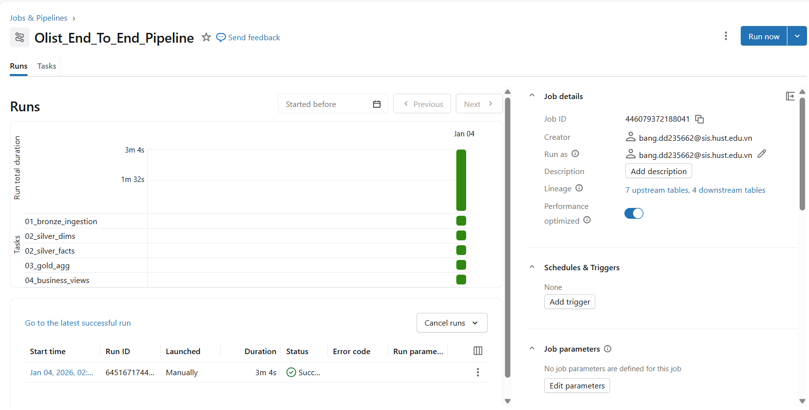
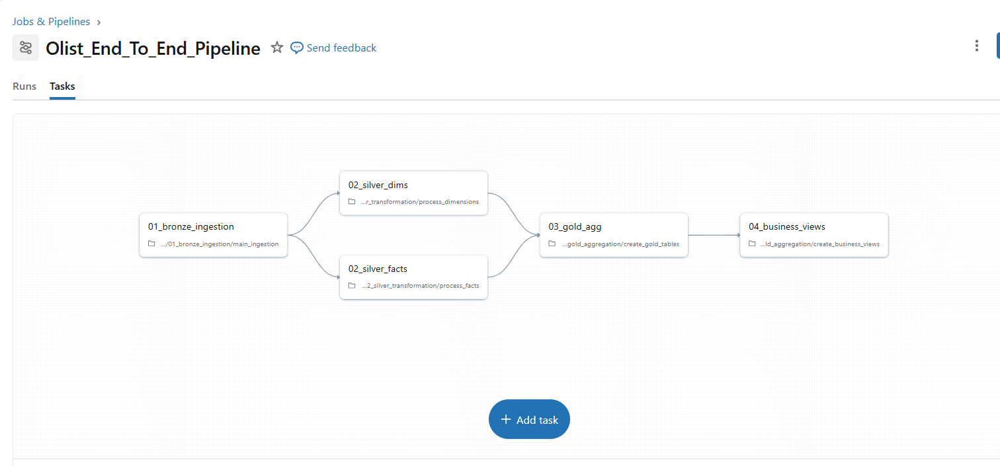
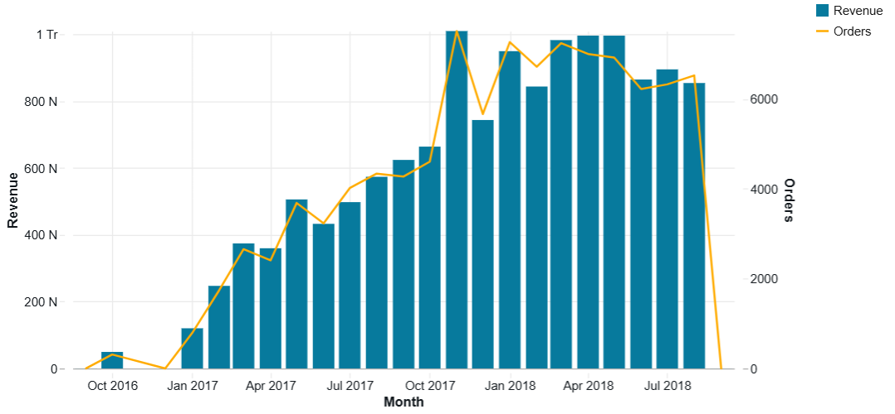
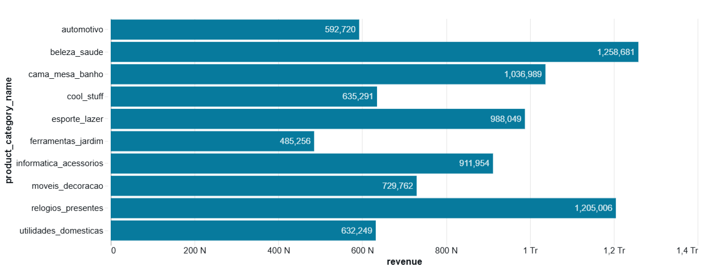
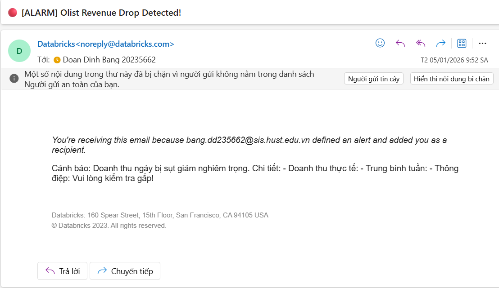

# 🛒 Olist E-Commerce End-to-End Lakehouse Project


> **Xây dựng Data Lakehouse chuẩn Production trên Databricks sử dụng kiến trúc Medallion, Spark Structured Streaming và Unity Catalog.**

---

## 📋 1. Tổng Quan Dự Án (Project Overview)

Dự án này xây dựng một pipeline dữ liệu hiện đại (Modern Data Pipeline) để xử lý bộ dữ liệu thương mại điện tử nổi tiếng **Brazilian E-Commerce Public Dataset by Olist**.

**Mục tiêu chính:**
Chuyển đổi dữ liệu giao dịch thô (Raw CSV) thành các thông tin chi tiết có giá trị kinh doanh (Business Insights) để trả lời các câu hỏi:
* Doanh thu thay đổi như thế nào theo thời gian?
* Danh mục sản phẩm nào bán chạy nhất?
* Phân bố địa lý của khách hàng ra sao?

---

## 🏗 2. Kiến Trúc Hệ Thống (Architecture)

Dự án áp dụng kiến trúc **Medallion (Multi-hop)** được quản trị bởi **Unity Catalog**:

1.  **Bronze Layer (Raw):** Ingest dữ liệu thô từ CSV, giữ nguyên lịch sử, sử dụng **Auto Loader**.
2.  **Silver Layer (Cleansed):** Làm sạch dữ liệu, chuẩn hóa Schema.
    * Áp dụng **SCD Type 2** cho các bảng Dimension (Customers, Sellers, Products).
    * Áp dụng **Streaming Deduplication** cho các bảng Fact.
3.  **Gold Layer (Curated):** Dữ liệu tổng hợp (Aggregated) theo mô hình Star Schema, tối ưu cho báo cáo.
4.  **Business Layer:** Các View phục vụ trực tiếp cho Dashboard.



---

## 🛠 3. Công Nghệ Sử Dụng (Tech Stack)

* **Cloud Platform:** Databricks on AWS/Azure.
* **Core Engine:** Apache Spark (Structured Streaming), Delta Lake.
* **Orchestration:** Databricks Workflows.
* **Governance:** Unity Catalog (Lineage, Access Control).
* **DevOps:** Git Integration (CI/CD basics).
* **Visualization:** Databricks SQL Dashboard.

---

## 🚀 4. Chi Tiết Kỹ Thuật (Key Features)

### 4.1. Ingestion Layer (Raw to Bronze)
Sử dụng **Auto Loader (`cloudFiles`)** để giải quyết bài toán Ingestion tự động:
* Tự động phát hiện file mới trong Volume.
* **Schema Evolution:** Tự động thích ứng khi cấu trúc file nguồn thay đổi (thêm cột mới).
* Thêm metadata `_source_file` và `_ingested_at` để truy vết nguồn gốc.

### 4.2. Transformation Layer (Bronze to Silver)
Đây là phần xử lý phức tạp nhất với logic nghiệp vụ cao cấp:

* **Slowly Changing Dimension (SCD) Type 2:**
    * Theo dõi lịch sử thay đổi của khách hàng/sản phẩm.
    * Logic: Đóng dòng cũ (`is_current=false`, update `end_date`) -> Mở dòng mới (`is_current=true`).
    * Code tham khảo: `utils/scd_handler.py`.

* **Data Quality Checks:**
    * Lọc bỏ dữ liệu rác (Ví dụ: Giá trị đơn hàng < 0, ID bị Null) ngay tại đầu vào Silver.

### 4.3. Orchestration (Databricks Workflows)
Toàn bộ quy trình được tự động hóa, đảm bảo tính phụ thuộc giữa các task.


*(Hình ảnh: Pipeline chạy thành công từ Bronze đến Gold)*

---

## 📊 5. Kết Quả Phân Tích (Analytics & Monitoring)

### 5.1. Business Dashboard
Dashboard trực quan giúp theo dõi sức khỏe doanh nghiệp theo thời gian thực.

**Xu hướng Doanh thu & Lượng đơn hàng:**


**Top Danh mục sản phẩm bán chạy:**


**Bản đồ phân bổ doanh thu theo Bang:**
.png)

### 5.2. Hệ thống Cảnh báo (Alerts)
Hệ thống tự động giám sát và gửi cảnh báo qua Email khi có bất thường (Ví dụ: Doanh thu giảm sâu so với trung bình quá khứ).



---

## 📂 6. Cấu Trúc Dự Án (Project Structure)

```text
databricks-medallion-ecommerce/
├── pipelines/                  # Mã nguồn ETL chính (Notebooks)
│   ├── 00_initialize/          # Setup Catalog & Schema
│   ├── 01_bronze_ingestion/    # Raw -> Bronze (Auto Loader)
│   ├── 02_silver_transformation/# Bronze -> Silver (SCD2, Streaming)
│   └── 03_gold_aggregation/    # Silver -> Gold (Aggregates)
├── utils/                      # Các hàm dùng chung (Reusable Functions)
│   ├── scd_handler.py          # Class xử lý SCD Type 2 Logic
│   └── spark_utils.py          # Class xử lý Auto Loader
├── tests/                      # Unit Test & Integration Test (SQL checks)
├── screenshot/                 # Hình ảnh minh họa cho README
└── README.md                   # Tài liệu dự án
```

## 🏁 7. Hướng Dẫn Cài Đặt (How to Run)

Để triển khai dự án này trên môi trường Databricks của bạn, hãy làm theo các bước sau:

### Bước 1: Chuẩn bị Môi trường
* Đảm bảo bạn có **Databricks Workspace** với **Unity Catalog** đã được kích hoạt.
* Tạo **Compute Cluster** với Runtime tối thiểu **13.3 LTS**.

### Bước 2: Setup Dữ liệu
1.  Tải bộ dữ liệu **Olist** từ Kaggle.
2.  Tạo Volume trong Unity Catalog để chứa dữ liệu thô:
    ```sql
    CREATE CATALOG IF NOT EXISTS olist_catalog;
    CREATE SCHEMA IF NOT EXISTS olist_catalog.bronze;
    CREATE VOLUME IF NOT EXISTS olist_catalog.bronze.raw_data;
    ```
3.  Upload các file CSV vào đường dẫn: `/Volumes/olist_catalog/bronze/raw_data/`.

### Bước 3: Deploy Code
1.  Vào **Databricks Workspace** -> **Git Folders**.
2.  Clone repository này về.

### Bước 4: Chạy Pipeline
1.  Chạy Notebook `pipelines/00_initialize/setup_catalog.sql` để khởi tạo database.
2.  Vào mục **Workflows**, tạo một **Job** mới với các Task nối tiếp nhau:
    * **Task 1:** `01_bronze_ingestion`
    * **Task 2:** `02_silver_transformation` (Dependent on Task 1)
    * **Task 3:** `03_gold_aggregation` (Dependent on Task 2)
3.  Nhấn **Run Now** và theo dõi quá trình xử lý.

---

## 🌟 8. Định Hướng Phát Triển (Future Improvements)

Do giới hạn về thời gian, dự án này tập trung vào Data Engineering cốt lõi. Trong tương lai, hệ thống có thể được mở rộng theo các hướng sau:

### 1. Nâng cao Chất lượng Dữ liệu (DQX)
* Tích hợp **Delta Live Tables (DLT)** để quản lý pipeline thay vì dùng Job thông thường.
* Sử dụng **DLT Expectations** để chặn dữ liệu lỗi (Quarantine) thay vì chỉ lọc bỏ.

### 2. Machine Learning & Forecasting
* Sử dụng dữ liệu ở Gold Layer để train model dự đoán doanh thu (**Time Series Forecasting**) dùng thư viện Prophet.
* Phân cụm khách hàng (**Customer Segmentation**) để chạy các chiến dịch Marketing.

### 3. CI/CD & Automation
* Sử dụng **Databricks Asset Bundles (DABs)** để đóng gói và deploy dự án tự động.
* Tích hợp **GitHub Actions** để chạy Unit Test mỗi khi merge code.

---
> **Author:** Đoàn Đình Bằng
